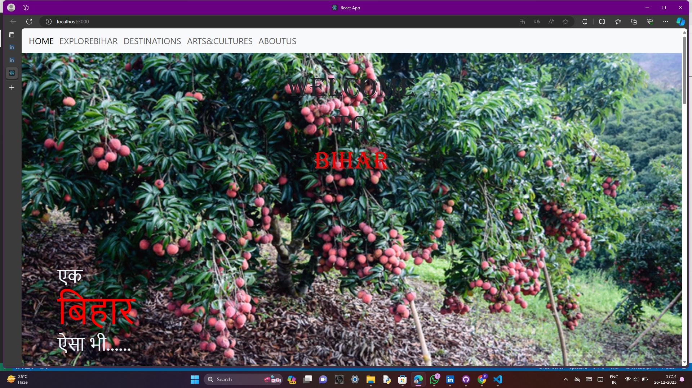
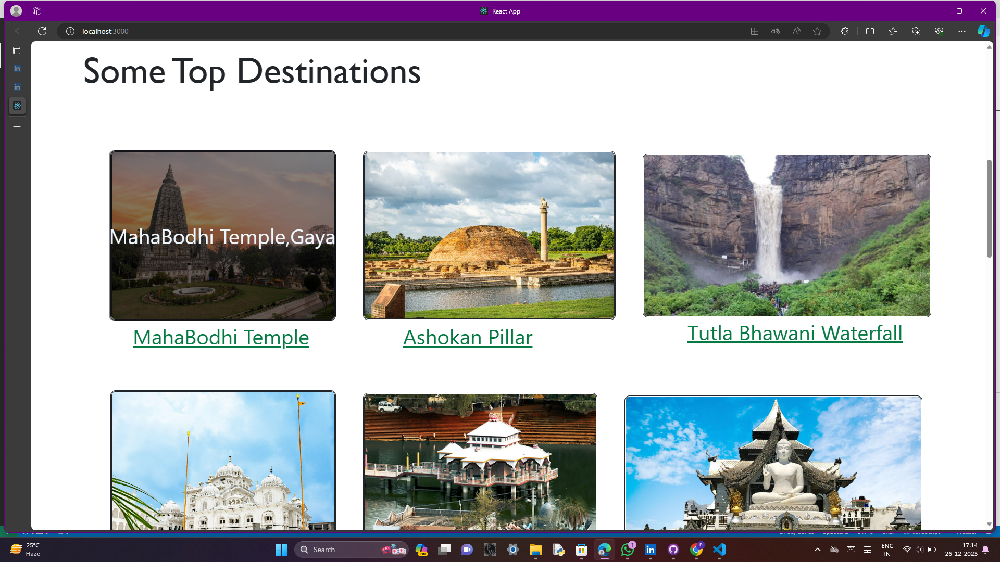
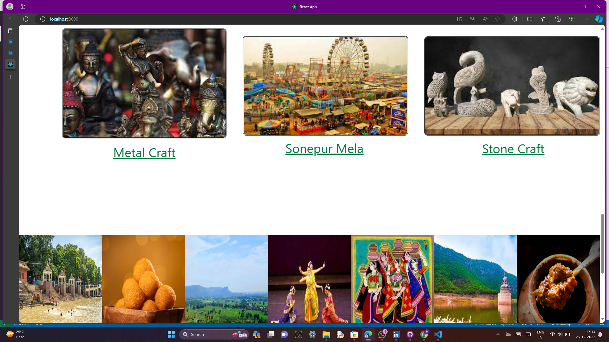
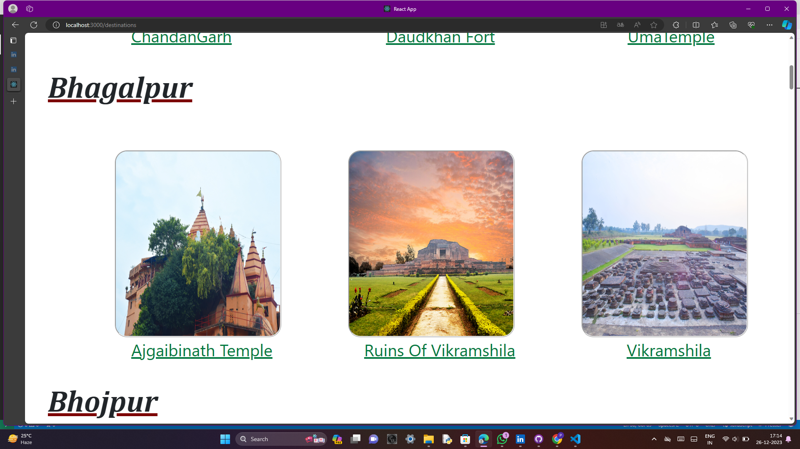
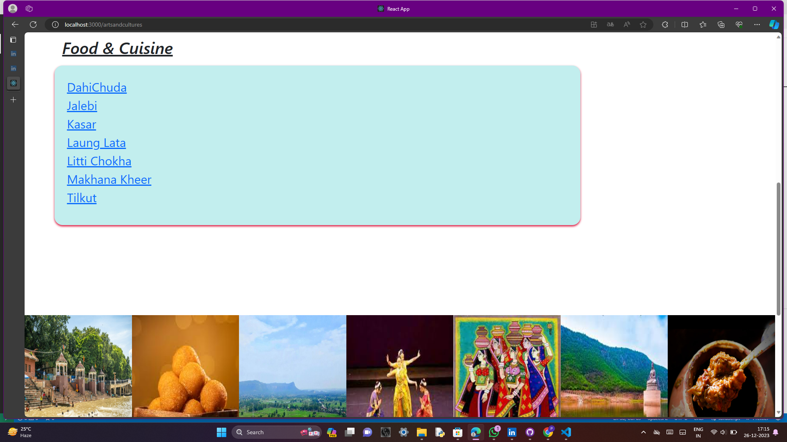

# Essences Of Bihar
"Essences of Bihar"
   is a fantastic website that talks about the cool and interesting stuff and places from the state of Bihar in India. It shows pictures and stories about Bihar's  historical places,special traditions, history, and art. Whether it's the fun festivals, old traditions, yummy food, or new things happening, the website is like a friend telling you all about the great things in Bihar. It's a simple way to learn and enjoy what makes Bihar awesome!
## Getting Started with Create React App
This project was bootstrap with [Create React App]
## Sample Preview
#Home Page

#destinations

#arts&culture

## Installation
`npm i -g npx`
-installation of npm 
`npm create-react-app `
-installation of node modules and package.json
`npx create-react-app bihar-tourist-planner`
-installation of modules and package
`npm run start`
-run the aap in development mode.\
open [http://localhost:3000](http://localhost:3000) to veiw it in your browser.

## Usage
`npm i react-dom`
`npm i react-router-dom`
- give the route 
`npm i bootstrap`
`npm i ngx-bootstrap-navbar`
- install the nav bar 

## License
- This project is licensed under the MIT License. 

## Contributing
Thank you for considering contributing to this project! Here are the basic steps:
1. **Fork** the repository.
2. Create a new branch (`git checkout -b feature/issue-name`).
3. Make your changes and **commit** them (`git commit -am 'Add new feature'`).
4. **Push** to the branch (`git push origin feature/issue-name`).
5. Create a new **Pull Request**.

## Contact
- Email: [priyapatel04122005@gmail.com](mailto:priyapatel04122005@gmail.com) | LinkedIn: [Priya Patel](https://www.linkedin.com/in/priya-patel-3a37b42a6/)
- Email: [prernasingh30089@gmail.com](mailto:prernasingh30089@gmail.com) | LinkedIn: [Prerna Singh](https://www.linkedin.com/in/prerna-singh-7717642a6/)
- Email: [supriyasingh03082004@gmail.com](mailto:supriyasingh03082004@gmail.com) | LinkedIn: [Supriya Singh](https://www.linkedin.com/in/supriya-singh-15034b2a4/)
- Email: [priyasms2021@gmail.com](mailto:priyasms2021@gmail.com) | LinkedIn: [Priya Raj](https://www.linkedin.com/in/priya-raj-258b8b27b?utm_source=share&utm_campaign=share_via&utm_content=profile&utm_medium=android_app)
- Email: [0808swetakumari@gmail.com](mailto:0808swetakumari@gmail.com) | LinkedIn: [Sweta Kumari ](https://www.linkedin.com/in/sweta-kumari-b523562a4?utm_source=share&utm_campaign=share_via&utm_content=profile&utm_medium=android_app)
