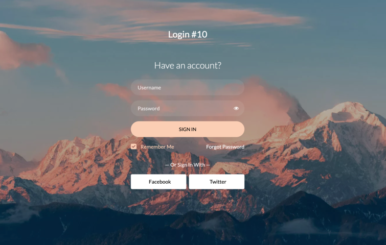

# WebWeave Messenger

This application represents a social messaging platform built upon the foundation of CSS and HTML.

Social messaging platforms yield extensive social and economic benefits. Socially, they streamline communication, fostering global connectivity and community cohesion irrespective of geographic boundaries. These platforms facilitate information dissemination, nurturing support networks and knowledge sharing. Economically, they offer businesses direct engagement with customers, reducing communication costs and enabling targeted marketing. They serve as invaluable tools for market research, aiding in product development and strategy. Moreover, their growth contributes to job creation in digital marketing, content creation, and customer service sectors, thereby amplifying economic opportunities and bolstering industries in the digital landscape.

## Sample Preview  

- Homepage
  
  

- Login Page

   

## Installation
- Describe the installation steps
- List any system dependencies or requirements

## Usage
- Provide examples or code snippets demonstrating usage
- Explain any necessary configurations or settings

## License
- This project is licensed under the MIT License. 

## Contributing
Thank you for considering contributing to this project! Here are the basic steps:
1. **Fork** the repository.
2. Create a new branch (`git checkout -b feature/issue-name`).
3. Make your changes and **commit** them (`git commit -am 'Add new feature'`).
4. **Push** to the branch (`git push origin feature/issue-name`).
5. Create a new **Pull Request**.

## Contact
- Email: [archit@mail.com](mailto:archit@mail.com) | LinkedIn: [Archit Verma](https://www.linkedin.com/in/living-legend/)
- Email: [mohsin@mail.com](mailto:mohsin@mail.com) | LinkedIn: [Mohsin Quershi](https://www.linkedin.com/in/mohsin-quresh-354049162/)
